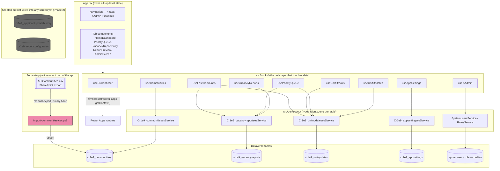

# Architecture — Vacancy Management

How the pieces of this app fit together. For a first-time, no-assumed-knowledge deployment walkthrough, see `DEPLOYMENT_GUIDE.md`. For the history of *why* things ended up this way, see `memory-bank.md`.

---

## The big picture



**The one thing worth internalizing:** components never call a generated service directly. Every data access goes `component → hook → generated service → Dataverse`. If you're hunting for where something is fetched or saved, start in `src/hooks/`, not the component.

**Unlike the sibling Team Leave Calendar app, this one has no external connectors** — no Outlook, no Teams, no Office 365 Users. Every data source is either a Dataverse table or the Power Apps runtime's own `getContext()` call (which just tells the app who's signed in). That makes the connection setup during deployment noticeably simpler.

---

## Layers, top to bottom

### 1. `App.tsx` — the only stateful root

Owns three pieces of top-level state: `activeTab`, `theme`, and `previewTarget` (which community/report `ReportPreview` should jump to when navigated in from elsewhere). Calls `useCommunities`, `useCurrentUser`, and `useIsAdmin` once and passes the results down as props. No Redux, no Context API for data — plain prop drilling, because the tree is shallow enough that it's never been worth more than that.

The Admin tab only appears in the navigation bar — and only renders — when `useIsAdmin` resolves to `true`. There's also a small safety `useEffect` that bounces anyone off the Admin tab if `isAdmin` becomes `false` while they're on it (e.g. stale state after a role change).

### 2. Components (`src/components/`) — mostly presentational

One folder per screen, matching the five navigation tabs:

| Folder | Tab | Notes |
|---|---|---|
| `HomeDashboard/` | Dashboard | Searchable property sidebar + KPI tiles (open vacancies, NTV, active applicants, approved hoppers, hopper goal/gap, vacancy rate) computed client-side from the selected community's most recent report |
| `PriorityQueue/` | Priority Queue | Portfolio-wide ranking of every community by vacancy rate, plus two derived-signal sections: the "Fast-Track Approvals" callout and the "Aging 30+ Days" column — see [Aging flag & Fast-Track Approvals](#aging-flag--fast-track-approvals-callout) below |
| `VacancyReportEntry/` | New Report | The actual weekly data-entry form. Card-per-unit layout (each unit is its own bordered card with a labeled CSS grid of fields) — replaced an earlier single-row-per-unit table after staff reported fields getting cut off |
| `ReportPreview/` | Report Preview | Read-only view of one saved report: a Units table (with the per-unit aging flag), a Summary-by-Status-Category table, and (admin-only) a Delete Report button |
| `AdminScreen/` | Admin *(hidden unless `isAdmin`)* | Edit the portfolio vacancy goal and, per-community, Hopper Goal / Active / Default Report Recipients |
| `shared/` | — | `Navigation.tsx` (tab bar), `StatusBadge.tsx` (icon + color pill for status categories — icon plus color, not color alone, per the app's accessibility requirement) |

### 3. Hooks (`src/hooks/`) — the entire data layer

| Hook | Talks to | Purpose |
|---|---|---|
| `useCurrentUser` | Power Apps runtime (`getContext()`) | Who's signed in — not Dataverse |
| `useIsAdmin` | `SystemusersService` + `RolesService` | Real Dataverse security-role check — see [Access control](#access-control-useisadmints) below |
| `useCommunities` | `Cr1e9_communitiesesService` | List all communities; admin-only update of Hopper Goal / Active / Default Report Recipients |
| `useVacancyReports` | `Cr1e9_vacancyreportsesService` | Create a report, list a community's reports, delete a report |
| `useUnitUpdates` | `Cr1e9_unitupdatesesService` | List a report's units, bulk-create units for a new report, delete all units for a report (used by the cascading report delete) |
| `useAppSettings` | `Cr1e9_appsettingsesService` | The single "Global" settings row (currently just the portfolio vacancy goal) — self-healing: creates the row if it doesn't exist yet instead of failing, so a freshly-migrated environment with no seeded data still works on first save |
| `usePriorityQueue` | `Cr1e9_vacancyreportsesService` + `Cr1e9_unitupdatesesService` | Portfolio-wide aggregation: latest report per community, vacancy rate, vacancy aging, and the aging-streak flag count — fetches all reports/units unfiltered and aggregates client-side rather than building a giant OR-filter string; fine at current data volume, revisit if report/unit counts grow much larger |
| `useUnitStreaks` | `Cr1e9_unitupdatesesService` | Given a community's report history and a target report, walks backward up to 8 prior reports and counts each open unit's consecutive-open streak (matched by trimmed/lowercased unit number — units aren't a persistent Dataverse entity, each weekly report creates fresh child rows) |
| `useFastTrackUnits` | `Cr1e9_vacancyreportsesService` + `Cr1e9_unitupdatesesService` | Portfolio-wide list of units currently "Submitted to Compliance" or "Corrections Requested" — feeds the Priority Queue's Fast-Track Approvals callout |
| `useReportCompleteness` | `Cr1e9_vacancyreportsesService` | Portfolio-wide map of each community's latest report date, for the Dashboard's ✅/⚠️ "reported in the last 7 days" indicator |
| `useCommunityDirectory` | `SharePointOnlineService` (SharePoint, not Dataverse) | Live read of a separate SharePoint list (RPS/RMS/Director/Compliance Specialist per community) for the Dashboard's role filters and "Show only my communities" — see [Community directory (SharePoint)](#community-directory-sharepoint) below |

### 4. Generated services (`src/generated/`) — typed clients, not hand-written

One `*Service.ts` + `*Model.ts` pair per data source, created by `npx power-apps add-data-source` and regenerated per environment (different publisher prefix per tenant). **Never edit these by hand** — re-run the CLI instead. Gitignored; see `DEPLOYMENT_GUIDE.md` for regenerating them on a new machine/tenant.

Eight pairs total: the six `cr1e9_*` tables below, plus `Systemusers` and `Roles` (built-in Dataverse identity tables, used only by `useIsAdmin`).

### 5. Dataverse tables

| Table | Written by | Read by |
|---|---|---|
| `cr1e9_communities` | `useCommunities` (admin fields only) + `scripts/import-communities-csv.ps1` (roster fields) | `useCommunities.refresh` (loaded once on app mount, held in `App.tsx`, passed everywhere) |
| `cr1e9_vacancyreports` | `useVacancyReports.createReport` / `.deleteReport` | `useVacancyReports.refresh`, `usePriorityQueue`, `useFastTrackUnits`, `useUnitStreaks` |
| `cr1e9_unitupdates` | `useUnitUpdates.createUnitRows` / `deleteUnitsForReport` | `useUnitUpdates.refresh`, `usePriorityQueue`, `useUnitStreaks`, `useFastTrackUnits` |
| `cr1e9_appsettings` | `useAppSettings.updatePortfolioVacancyGoal` | `useAppSettings.refresh` |
| `cr1e9_applicantupdatehistory` | *nothing yet* | *nothing yet* — table + relationship exist, no screen uses it (Phase 2 audit-trail idea) |
| `cr1e9_reportconfiguration` | *nothing yet* | *nothing yet* — meant to let an admin manage status-category display config in-app instead of it being fixed in code (Phase 2) |

`cr1e9_vacancyreport` (singular) is a stray, unrelated table from the sibling Team Leave Calendar project that briefly ended up in the wrong solution during setup — it isn't used by this app and shouldn't be confused with `cr1e9_vacancyreports` (plural) above.

---

## Access control (`useIsAdmin.ts`)

There's no hardcoded email allow-list — access is a real Dataverse security-role check:

1. `useIsAdmin(email)` looks up the signed-in user's `systemuserid` from their UPN via `SystemusersService` (`domainname eq '<email>'`).
2. It then queries `RolesService` for a role named exactly `APP - AH Vacancy Management Admin`, filtered further by an OData `any()` lambda against the `systemuserroles_association` N:N relationship — this checks whether *that specific user* holds *that specific role*, in one query. (The generated Code App SDK has no `$expand` support, but a plain `filter` string with `any()` works fine and doesn't need it.)
3. `App.tsx` uses the boolean result to decide whether the Admin tab renders at all.

Two Dataverse security roles are assigned to real users (stacked additively — Dataverse roles don't "deny," they only add privileges):

- **A base role** (e.g. "VM Staff") — Organization-scope Read on all six `cr1e9_*` tables (this is a shared-portfolio-visibility app; nobody's data is siloed to just their own community), plus Create/Write on `cr1e9_vacancyreports` and `cr1e9_unitupdates` so staff can actually submit reports.
- **An additive admin role**, named **exactly** `APP - AH Vacancy Management Admin` — Write on `cr1e9_appsettings` and the admin-only fields on `cr1e9_communities`.

**If the role is ever renamed in the target environment, `ADMIN_ROLE_NAME` in `useIsAdmin.ts` has to be updated to match** — there's no other place this name lives. Unlike the sibling Team Leave Calendar app, there's currently no `setup-security-role.ps1` script for this app; both roles are created and assigned by hand through the Power Platform admin center. See `DEPLOYMENT_GUIDE.md` for the walkthrough.

---

## Community roster (`scripts/import-communities-csv.ps1`)

The Communities table is seeded from a **manual CSV export** of a SharePoint list, not a live sync. `scripts/import-communities-csv.ps1`:

- Upserts by matching on Community Code, so re-running with a fresh export updates changed contacts and adds newly-acquired properties without duplicating rows.
- Never touches the "app-owned" fields (`cr1e9_hoppergoal`, `cr1e9_active`, `cr1e9_defaultreportrecipients`) — those are only ever set from inside the app's Admin screen, so a re-import can't clobber them.
- Expects the raw SharePoint "export to CSV" format (a metadata line 1, real headers on line 2) — see the comment block at the top of the script for the exact column mapping.

A true live sync (SharePoint list change → Dataverse automatically) was deferred, not built — see `memory-bank.md`'s "Real community roster" section for the two specific blockers if this gets picked up later.

---

## Community directory (SharePoint)

Unlike the community roster above, the RPS/RMS/Director/Compliance Specialist assignments (`useCommunityDirectory.ts`) are read **live** from a separate SharePoint list, not imported into Dataverse — that list changes often enough that a periodic CSV re-import would go stale, per the Affordable Housing Team's request. This uses a fundamentally different connector pattern than every other data source in this app: the SharePoint Online connector generates one shared `SharePointOnlineService` (`GetItems`/`GetItem`/`PostItem`/`PatchItem`/`DeleteItem`) parameterized by `dataset` (site URL) + `table` (list name), rather than Dataverse's one-typed-service-per-table pattern.

**This needs one manual setup step per environment that isn't done yet in dev** — dev is in a different Microsoft tenant than HumanGood's and can't reach that SharePoint site at all (same cross-tenant wall as the community roster). `src/generated/services/SharePointOnlineService.ts` is currently a hand-written local stub (gitignored) so the app builds; see `DEPLOYMENT_GUIDE.md`'s "Optional: Connect the live community directory" section for the real setup steps once working in the target tenant. Until that's done, the Dashboard's role filters and "Show only my communities" checkbox just have nothing to show — everything else in the app works normally regardless.

Community matching between the two systems is a normalized (trim + lowercase) exact match of the SharePoint list's `Title` column against `cr1e9_communities.cr1e9_name` — a community with no matching row in the directory list simply won't match any filter.

---

## Aging flag & Fast-Track Approvals callout

Two derived, always-computed-from-history signals added after UX reviews — neither writes to Dataverse, both are computed fresh on every load:

- **Aging flag** (`AGING_DAYS_THRESHOLD = 30` in `types.ts`): matches the priority logic described in the Affordable Housing Team's meeting ("vacant 30+ days gets bumped to the top"). Primary signal is a real day-count — today's/the report's date minus the unit's Vacant Since date (`cr1e9_actualvacancydate`) — the same date already used for the Priority Queue's Avg/Longest Days Vacant figures. For units missing that date (common on older/incomplete reports), it falls back to `useUnitStreaks.ts`'s consecutive-report streak (`AGING_STREAK_THRESHOLD = 3`) so the flag doesn't silently miss a unit just because staff never filled in a date. Shown per-unit as a red 🚩 badge in Report Preview's "Aging" column, and rolled up into an "Aging 30+ Days" count per community in the Priority Queue. Deliberately doesn't touch the manual per-unit Risk dropdown (Low/Medium/High/Critical, filled in by staff) — this is a separate, always-accurate signal that doesn't depend on anyone remembering to update a field.
- **Fast-Track Approvals** (`useFastTrackUnits.ts`): units whose Status Detail is "Submitted to Compliance" or "Corrections Requested" are pulled into a dedicated callout at the top of the Priority Queue screen, portfolio-wide — these are expected to convert to "Approved" fastest, so they're surfaced without anyone having to dig through each community's report individually. Corrections Requested sorts above Submitted to Compliance (it's blocking on staff/applicant action; Submitted to Compliance is just waiting on the reviewer). Kept as a separate section from the aging flag rather than merged into one list — they're different urgency types (about to fill vs. stuck too long) needing different follow-up.

---

## What got descoped (worth knowing if this resurfaces)

The Priority Queue here is a deliberately scaled-down version of a much larger "Compliance Impact Barometer" feature originally requested (multi-factor compliance file scoring, priority bands, work-queue assignment, manual overrides, 4 additional tables, 3 Power Automate flows, 6 Power BI pages). It was scoped down because the data foundation it needed — applicant as a first-class entity, a document/verification checklist, rent-ready/turn-percentage fields — doesn't exist yet. Full detail preserved in `memory-bank.md` in case it comes back.

Similarly, there's no AI extraction and no PDF export by design: staff fill out a structured form directly, and Power BI is meant to connect straight to the Dataverse tables for cross-community trend analysis rather than the app generating its own reports/exports.

---

## Build & deploy

```
npm run build          # tsc -b && vite build → dist/
npx power-apps push    # uploads dist/ to the app registered in power.config.json
```

Both commands are ordinary — no Claude-specific tooling anywhere in this pipeline. `power.config.json` (which app, which environment, which connections) and `src/generated/` (typed per-environment clients) are the only two files that differ machine-to-machine; everything else in git is portable.

---

## Conventions worth knowing before changing things

- **No Redux, no Context API for data.** State lives in the hook that owns it, or in `App.tsx` if multiple tabs need it. Prop drilling is intentional, not an oversight.
- **CSS custom properties for theming**, not a CSS-in-JS library. Light/dark tokens live in `src/index.css` under `:root`/`[data-theme="light"]`, toggled via `document.documentElement.setAttribute('data-theme', ...)` in `App.tsx`. Inline `style={{ ... }}` objects reference `var(--token-name)` everywhere rather than hardcoding colors. Any new table, list, or block of real data needs an explicit `backgroundColor: 'var(--bg-surface)'` (or `--bg-subtle`) on its wrapper — the branded gradient/watermark behind the page will make un-boxed text hard to read otherwise.
- **Hooks own CRUD, components own layout.** Adding a new piece of data follows: generated service (via `add-data-source`) → a hook that maps Dataverse field names to a clean app-level type → components consume the hook's return value, never the generated service directly.
- **A new report always creates a brand-new `VacancyReport` + `UnitUpdate` rows; editing is restricted to a community's single most recent report.** Each weekly report is meant to be a fixed snapshot once superseded — that's what the aging-flag streak fallback and Fast-Track Approvals features rely on for accurate history — so `VacancyReportEntry.tsx`'s edit mode (entered via "Edit This Report" in Report Preview, only offered when `reports[0]?.id === report.id`) can change unit-level fields and Notes, but Community/Report Date/Title stay locked. See `useUnitUpdates.ts`'s `updateUnitRow`/`deleteUnit`/`toUnitRowDraft` for how an edit reconciles against what's already in Dataverse.
- **Report titles are auto-generated**, not typed in — `formatReportTitle()` produces `"{Community} - Vacancy Report - Week Of M/D/YYYY"` so names stay standardized across staff.
- **Status Category vs. Status Detail are two different axes**, don't conflate them: Status Category is the coarse 7-value bucket used for the Units-by-status summary and the aging-streak "is this unit still open" check (`STATUS_CATEGORY_LABEL`, values like Approved / Compliance Approved / Waitlist / Compliance Review). Status Detail is a finer ~20-value picklist (`STATUS_DETAIL_LABEL`) used for the Fast-Track Approvals callout ("Submitted to Compliance", "Corrections Requested", etc.).
